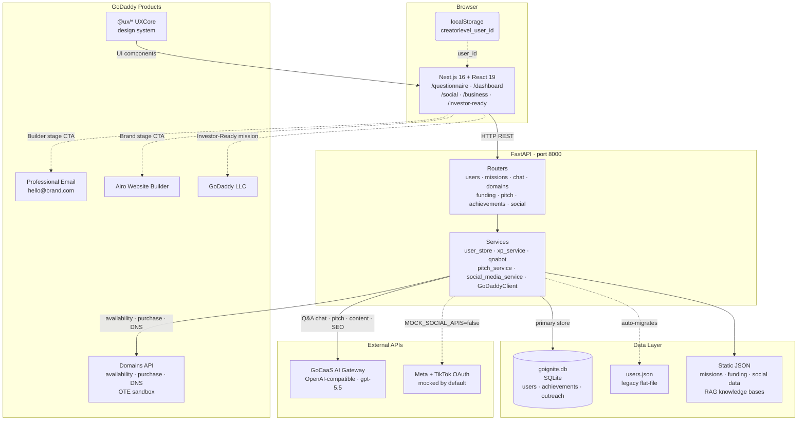

# GoIgnite

## Context

A step-by-step platform that helps young entrepreneurs launch new businesses or scale existing ideas, powered by GoDaddy's full suite of business tools.

Users progress through four stages — Starter → Builder → Brand → Investor-Ready — completing daily missions that build their business piece by piece. Each stage unlocks the next tier of GoDaddy tools and surfaces AI-powered guidance tailored to where they are. The platform is designed to pre-qualify and onboard new entrepreneurs into GoDaddy's ecosystem through a structured, gamified on-ramp.

---

## Tech Stack

| Layer | Choice | Notes |
|---|---|---|
| Frontend | Next.js 16 + React 19 + TypeScript | Tailwind CSS v4; GoDaddy `@ux/*` UXCore component library (20+ packages) |
| UI Components | GoDaddy UXCore (`@ux/*` at `^2500.x`) | `@ux/button`, `@ux/card`, `@ux/modal`, etc.; transpiled via `next.config.ts` |
| Backend | Python + FastAPI | Async, lightweight; `uvicorn` server |
| AI | GoCaaS AI Gateway (OpenAI-compatible) | Model `gpt-5.5` via internal GoDaddy AI gateway; powers Q&A advisor, pitch deck, social content, growth plans, SEO |
| Data | JSON flat-file (`users.json`) + SQLite | `user_store.py` reads/writes both transparently; SQLite is primary, JSON is legacy fallback. See [Database](#database). |
| Auth | UUID in browser `localStorage` | No server-side auth. User identity is a UUID stored under key `creatorlevel_user_id`. |
| GoDaddy | Domains API (real) + Airo LLC tool | `httpx` async wrapper; `sso-key` auth; OTE test env via `GODADDY_OTE=true` |

---

## Architecture



---

## Project Structure

```
hackathon2026/
├── Assets/                          # Brand images, fonts, illustrations (GIF, PNG, MP4, TTF, PDF)
├── backend/
│   ├── app/
│   │   ├── main.py                  # FastAPI app, CORS (allow-all), router registration
│   │   ├── store.py                 # (legacy stub)
│   │   ├── routes/
│   │   │   ├── users.py             # /api/users — create, get, patch onboarding       ✓
│   │   │   ├── missions.py          # /api/missions — today's missions + completion     ✓
│   │   │   ├── achievements.py      # /api/users/{id}/achievements                      ✓
│   │   │   ├── domains.py           # /api/domains — GoDaddy Domains API full lifecycle ✓
│   │   │   ├── funding.py           # /api/funding — funding discovery engine           ✓
│   │   │   ├── chat.py              # /api/chat — AI-powered Q&A business advisor       ✓
│   │   │   ├── pitch.py             # /api/pitch — pitch deck generation                ✓
│   │   │   └── social_media.py      # /api/social — social growth + SEO toolkit         ✓
│   │   ├── services/
│   │   │   ├── db.py                # SQLAlchemy SQLite; tables: users, achievements, outreach ✓
│   │   │   ├── user_store.py        # Dual-store: SQLite (primary) + JSON migration      ✓
│   │   │   ├── achievement_store.py # Achievement persistence layer                      ✓
│   │   │   ├── xp_service.py        # XP calculation + stage promotion                  ✓
│   │   │   ├── domains.py           # GoDaddy async httpx client (GoDaddyClient)         ✓
│   │   │   ├── domain_ai.py         # AI call to generate domain name candidates         ✓
│   │   │   ├── funding_service.py   # Funding opportunity filtering                      ✓
│   │   │   ├── social_media_service.py  # Social OAuth, stats, AI content generation    ✓
│   │   │   ├── pitch_service.py     # Pitch deck generation via AI                       ✓
│   │   │   ├── qnabot/
│   │   │   │   ├── prompts.py       # System prompt + context headers                    ✓
│   │   │   │   └── tools/
│   │   │   │       ├── ai_tool.py   # AI API call wrapper                                ✓
│   │   │   │       └── retrieval.py # Keyword-based RAG from business_knowledge.json     ✓
│   │   │   └── pitch_kb/
│   │   │       ├── prompts.py       # Pitch deck system prompt                           ✓
│   │   │       ├── retrieval.py     # Keyword-based RAG from pitch_knowledge.json        ✓
│   │   │       └── data/
│   │   │           └── pitch_knowledge.json
│   │   ├── models/
│   │   │   ├── user.py              # User, Stage, CreatorType Pydantic models           ✓
│   │   │   ├── mission.py           # Mission model                                      ✓
│   │   │   ├── achievement.py       # Achievement model                                  ✓
│   │   │   ├── funding.py           # FundingOpportunity model                           ✓
│   │   │   └── domains.py           # Domain contact, record, purchase models            ✓
│   │   └── data/
│   │       ├── missions.json        # 23 mission templates per stage                     ✓
│   │       ├── funding.json         # 15 funding opportunities                           ✓
│   │       ├── seo_keywords.json    # SEO keyword bank by creator type + platform        ✓
│   │       ├── social_missions.json # 22 social-specific missions                        ✓
│   │       ├── social_monetization.json
│   │       ├── social_platform_guides.json
│   │       ├── social_stage_gates.json
│   │       └── social_templates.json
│   ├── data/
│   │   ├── goignite.db              # SQLite database (auto-created on first run)
│   │   └── users.json               # Legacy JSON user store
│   ├── scripts/
│   │   └── migrate_user_to_db.py    # One-time migration: JSON user → SQLite row
│   ├── requirements.txt
│   └── .env.example
│
├── frontend/
│   ├── scripts/
│   │   └── vendor-uxcore.mjs        # Vendor script for GoDaddy UXCore packages
│   ├── package.json                 # Next.js 16 + React 19 + all @ux/* dependencies
│   └── src/
│       ├── app/
│       │   ├── layout.tsx           # Root layout — GDSage font, metadata
│       │   ├── page.tsx             # / → redirects immediately to /questionnaire
│       │   ├── globals.css          # Tailwind v4 + @ux/tailwind-intents + all theme sheets
│       │   ├── questionnaire/page.tsx
│       │   ├── dashboard/page.tsx
│       │   ├── business/page.tsx
│       │   ├── social/page.tsx
│       │   └── investor-ready/page.tsx
│       ├── components/
│       │   ├── chat/
│       │   │   └── chat-widget.tsx          # Floating AI chat panel
│       │   ├── questionnaire/
│       │   │   ├── questionnaire-shell.tsx  # 5-step onboarding wizard state machine
│       │   │   ├── questionnaire-header.tsx
│       │   │   ├── questionnaire-building.tsx
│       │   │   └── steps/                   # step-welcome, step-business-type, step-pitch, step-confusion, step-existing, step-budget, step-comfort
│       │   ├── dashboard/
│       │   │   ├── dashboard-shell.tsx      # Top-level sidebar + header layout
│       │   │   ├── dashboard-header.tsx
│       │   │   ├── dashboard-sidebar.tsx
│       │   │   ├── todays-missions.tsx
│       │   │   ├── domain-suggestions.tsx   # AI domain names + GoDaddy availability
│       │   │   ├── stage-roadmap.tsx        # 4-stage visual progression
│       │   │   ├── achievements-panel.tsx
│       │   │   ├── focus-area-cards.tsx     # Idea / Presence / Earnings cards
│       │   │   └── ...                      # welcome-banner, metric-card, business-overview-widget, ai-companion, etc.
│       │   ├── business/
│       │   │   ├── business-shell.tsx
│       │   │   └── business-overview-page.tsx
│       │   ├── social/
│       │   │   ├── social-shell.tsx         # Social hub top-level component
│       │   │   ├── platform-connect.tsx     # OAuth connect (Instagram/TikTok/Facebook)
│       │   │   ├── content-ideas.tsx        # AI 7-day content plan
│       │   │   ├── growth-plan.tsx          # AI 30-day growth advisor
│       │   │   ├── seo-tools.tsx            # Bio scorer + keyword finder + caption optimizer
│       │   │   ├── outreach-tracker.tsx     # Brand deal CRM log
│       │   │   └── monetization-paths.tsx
│       │   └── investor-ready/
│       │       ├── investor-ready-shell.tsx # Pitch deck generator UI
│       │       └── congrats-animation.tsx
│       ├── hooks/
│       │   ├── use-dashboard.ts     # Loads user + missions + achievements; handles completeMission
│       │   ├── use-get-started.ts   # Milestone checklist with localStorage + XP count-up animation
│       │   └── use-social.ts        # Loads user/creatorType for the Social page
│       ├── lib/
│       │   ├── dashboard-data.ts    # All frontend TypeScript types; buildPrimaryNav() + buildGrowthNav()
│       │   ├── map-dashboard.ts     # ApiUser + missions + achievements → DashboardUser
│       │   ├── stages.ts            # Stage config + XP thresholds + unlock logic
│       │   ├── get-started.ts       # Get-started milestone stage definitions
│       │   ├── business-name-ideas.ts
│       │   └── questionnaire-chips.tsx  # Chip option definitions for questionnaire steps
│       ├── services/
│       │   └── api.ts               # Centralised fetch wrapper; base URL = NEXT_PUBLIC_API_URL (default: http://localhost:8000)
│       ├── styles/
│       │   ├── dashboard-theme.css
│       │   ├── godaddy-theme.css
│       │   ├── questionnaire.css
│       │   ├── congrats-animation.css
│       │   ├── uxcore-components.css
│       │   └── uxcore-icons.css
│       └── fonts/
│           ├── GDSage-Bold.ttf
│           └── GDSage-Medium.ttf
│
├── package.json                     # pnpm workspace root; delegates all scripts to frontend/
├── pnpm-lock.yaml
└── README.md
```

---

## Frontend Pages

| Route | Purpose |
|---|---|
| `/` | Redirects immediately to `/questionnaire` |
| `/questionnaire` | 5-step onboarding wizard; creates user on completion |
| `/dashboard` | Main gamified home — missions, XP, stage roadmap, domain suggestions |
| `/business` | Business profile overview |
| `/social` | Social media tools hub — content ideas, growth plan, SEO, outreach tracker |
| `/investor-ready` | Pitch deck generator |

All page files are thin wrappers that render a single "Shell" component.

---

## Core Data Models

### User
```json
{
  "user_id": "uuid",
  "creator_type": "fashion|gaming|fitness|art|food",
  "stage": "starter|builder|brand|investor_ready",
  "xp_total": 0,
  "completed_missions": [],
  "business_profile": { "bio": "", "pitch": "", "revenue_goal": "" },
  "onboarding_data": {},
  "godaddy_domain": null,
  "created_at": "ISO8601"
}
```

### Mission
```json
{
  "mission_id": "investor-llc",
  "stage": "investor_ready",
  "creator_types": ["all"],
  "title": "Register your LLC via GoDaddy",
  "description": "...",
  "xp_reward": 200,
  "completion_prompt": "Confirm your LLC has been registered",
  "achievement_title": "Official Business Entity",
  "achievement_category": "business_setup"
}
```

### Achievement (auto-generated on mission completion)
```json
{
  "achievement_id": "uuid",
  "user_id": "uuid",
  "title": "Official Business Entity",
  "date": "ISO8601",
  "impact": "Official Business Entity · +200 XP",
  "category": "business_setup|funding|monetization|stage_milestone"
}
```

### Funding Opportunity
```json
{
  "id": "ycombinator",
  "name": "Y Combinator",
  "type": "accelerator",
  "description": "...",
  "amount": "$500,000 for 7% equity",
  "deadline": "Cohort-based (Jan / Sep)",
  "eligibility_stages": ["investor_ready"],
  "creator_types": ["all"],
  "requirements": ["..."],
  "application_url": "https://www.ycombinator.com/apply",
  "tags": ["accelerator", "equity", "top-tier"]
}
```

---

## API Routes

| Method | Route | Description |
|---|---|---|
| GET | `/health` | Health check |
| POST | `/api/users/create-new-user` | Create a new user (UUID assigned) |
| GET | `/api/users/{id}` | Get user profile + XP + stage |
| PATCH | `/api/users/{id}/onboarding-data` | Update onboarding answers |
| GET | `/api/users/{id}/achievements` | User achievements |
| GET | `/api/missions/today/{user_id}` | Up to 5 personalised missions for today |
| POST | `/api/missions/{id}/complete` | Mark complete, award XP, check stage promotion |
| POST | `/api/chat` | AI Q&A business advisor (RAG + GoCaaS) |
| GET | `/api/domains/ai-suggest/{user_id}` | AI-generated domain candidates + GoDaddy availability |
| GET | `/api/domains/available` | Check single domain availability |
| POST | `/api/domains/available/bulk` | Bulk domain availability check |
| GET | `/api/domains/suggest` | GoDaddy keyword-based suggestions |
| POST | `/api/domains/purchase` | Purchase a domain via GoDaddy |
| GET | `/api/domains/{domain}/records` | List DNS records |
| PATCH | `/api/domains/{domain}/records` | Add DNS records |
| GET | `/api/funding` | Funding opportunities (filter by `?stage` + `?creator_type`) |
| POST | `/api/pitch/outline` | Generate full pitch deck (all slides) |
| POST | `/api/pitch/phase` | Generate one pitch phase (1–4) |
| GET | `/api/social/connect/{platform}` | OAuth authorization URL for instagram/tiktok/facebook |
| GET | `/api/social/callback/{platform}` | OAuth code exchange + redirect to frontend |
| GET | `/api/social/mock-oauth/{platform}` | Instant mock connect (no redirect); returns fake stats |
| GET | `/api/social/stats/{user_id}` | Platform follower/engagement stats |
| GET | `/api/social/missions/{user_id}` | Social missions filtered by stage + creator_type |
| GET | `/api/social/missions/all` | All social missions unfiltered |
| POST | `/api/social/missions/{mission_id}/complete` | Complete social mission, write achievement |
| GET | `/api/social/templates` | Outreach templates by stage + platform |
| GET | `/api/social/guides` | Platform guides (IG/TikTok/FB/LinkedIn) by stage |
| GET | `/api/social/stage-gate/{stage}` | Social unlock messaging for a given stage |
| POST | `/api/social/content-ideas` | AI 7-day content plan |
| GET | `/api/social/outreach/{user_id}` | Brand outreach pipeline log |
| POST | `/api/social/outreach/{user_id}` | Log a new brand outreach entry |
| PATCH | `/api/social/outreach/{user_id}/{entry_id}` | Update outreach status; fires achievement on first "deal" |
| GET | `/api/social/achievements/{user_id}` | All social achievements for a user |
| GET | `/api/social/next-action/{user_id}` | Highest-impact incomplete mission |
| GET | `/api/social/monetization-advice` | Monetization paths by creator type + follower count |
| POST | `/api/social/growth-plan` | AI 30-day growth plan |
| GET | `/api/social/seo/keywords` | SEO keywords by creator type + platform |
| POST | `/api/social/seo/profile` | Score + rewrite a bio for SEO discoverability |
| POST | `/api/social/seo/content` | Rewrite a caption for maximum platform discoverability |

---

## Social Media & Marketing Module

`social_media_service.py` handles OAuth, platform stats, AI content generation, and achievement writes. The full hub lives in `social-shell.tsx` across multiple sections.

- **Platform Connect**: OAuth flow for Instagram, TikTok, and Facebook — set `MOCK_SOCIAL_APIS=true` in `.env` to bypass all external calls for demo
- **Live Stats**: Follower count, engagement rate, and recent post performance pulled per connected platform
- **Social Missions**: 22 missions across all 4 stages, filtered by creator type — completions write achievements with real milestone impact descriptions
- **AI Content Plan**: `POST /api/social/content-ideas` calls the GoCaaS AI gateway to generate a 7-day post calendar with hooks, captions, and hashtags; falls back to a static mock if no API key is set
- **Outreach Tracker**: Brand deal pipeline with status tracking across Starter → Investor-Ready; entries 7+ days old with status "sent" surface a follow-up reminder; closing a deal auto-fires an achievement
- **Outreach Templates + Platform Guides**: 9 copy-paste DM/email templates and IG/TikTok/FB/LinkedIn guides, all scoped by stage
- **SEO Tools**: Bio scorer + keyword finder + caption optimizer (`POST /api/social/seo/*`)

---

## XP & Stage Progression

| Stage | XP Required | GoDaddy Gate | Focus |
|---|---|---|---|
| Starter | 0 | — | Brand basics and pitch |
| Builder | 300 XP | Domain registration | Audience, products, first revenue |
| Brand | 700 XP | Professional email | Media kit, pitch deck, revenue growth |
| Investor-Ready | 1500 XP | Full business suite + LLC registration | Funding, accelerators, formal incorporation |

Stage promotion is handled in `xp_service.py`. On promotion:
1. XP threshold crossed → `stage` field updated
2. Achievement auto-created: e.g. "Reached Builder Stage"
3. GoDaddy upgrade prompt surfaced in frontend

---

## AI Layer — GoCaaS Integration

All AI calls use the **GoCaaS AI Gateway** (`https://caas-gocode-prod.caas-prod.prod.onkatana.net/v1`), which exposes an OpenAI-compatible API. The client is `AsyncOpenAI(base_url=..., api_key=API_KEY)` with model `gpt-5.5`. All AI features degrade gracefully to static mock data when `API_KEY` is not set.

**1. Q&A Business Advisor** (`qnabot/`) — `POST /api/chat`
- System prompt: warm, direct business advisor persona; plain language; no filler
- Keyword-based RAG retrieves relevant GoDaddy KB entries (`business_knowledge.json`) and injects them as grounded context
- Only surfaces GoDaddy products when they genuinely fit — never fabricated
- Accepts optional `user_id` to personalise responses based on the user's stage, creator type, and bio

**2. Social content ideas** — `POST /api/social/content-ideas`
- Input: niche, audience, platform, creator type
- Output: 7-day post calendar with hooks, captions, and hashtags

**3. Growth plan generation** — `POST /api/social/growth-plan`
- Input: user stage, creator type, completed missions, social stats
- Output: prioritised 30-day growth plan

**4. SEO content optimisation** — `POST /api/social/seo/content`
- Input: draft content + target keywords
- Output: SEO-optimised rewrite with metadata suggestions

**5. Pitch deck generation** — `POST /api/pitch/outline`
- Input: user's completed missions, creator type, revenue goal
- Output: JSON with named sections (bio, problem, product, traction, ask) → rendered in `InvestorReadyShell`

**6. Domain name generation** — `GET /api/domains/ai-suggest/{user_id}`
- Input: user's business profile
- Output: AI-generated domain name candidates + GoDaddy availability check

---

## GoDaddy Integration

`services/domains.py` defines `GoDaddyClient` — an async `httpx` wrapper around the real GoDaddy Domains API. Frontend shows real upgrade flows:

- **Starter → Builder**: "Your business needs a home. Register `{brand}.com` on GoDaddy"
- **Builder → Brand**: "Go pro with `hello@{brand}.com` — GoDaddy Workspace Email"
- **Brand → Investor-Ready**: "Your pitch is ready. Launch your full site with GoDaddy Website Builder"
- **Investor-Ready (LLC)**: Mission `investor-llc` (+200 XP) directs users to [GoDaddy Airo LLC registration](https://www.godaddy.com/airo/register-llc)

Auth via `sso-key {GODADDY_API_KEY}:{GODADDY_API_SECRET}` header; OTE test environment via `GODADDY_OTE=true`.

**Required env vars (`backend/.env`):**
```
API_KEY=                   # GoCaaS AI gateway key (must start with sk-)
GODADDY_API_KEY=
GODADDY_API_SECRET=
GODADDY_OTE=true           # true = OTE sandbox, false = production

# Social OAuth (leave blank/true to use mock data)
MOCK_SOCIAL_APIS=true
META_APP_ID=
META_APP_SECRET=
META_REDIRECT_URI=http://localhost:8000/api/social/callback/instagram
TIKTOK_CLIENT_KEY=
TIKTOK_CLIENT_SECRET=
TIKTOK_REDIRECT_URI=http://localhost:8000/api/social/callback/tiktok
```

**Optional frontend env var (`frontend/.env.local`):**
```
NEXT_PUBLIC_API_URL=http://localhost:8000   # defaults to this if not set
```

---

## Build Order

### Phase 1 — Foundation ✓
1. ✓ FastAPI scaffold + user + mission routes
2. ✓ Next.js frontend + global styles + `api.ts` fetch wrapper

### Phase 2 — Core Loop ✓
3. ✓ Onboarding quiz → creator type → user created
4. ✓ Mission list + completion + XP bar
5. ✓ Stage promotion logic (`xp_service.py`)

### Phase 3 — AI + Growth ✓
6. ✓ AI Q&A business advisor (`qnabot/` + `POST /api/chat`)
7. ✓ Social growth toolkit (content ideas, growth plan, SEO, outreach tracker)
8. ✓ Accomplishments dashboard (achievement writes on mission complete)

### Phase 4 — Discovery + Funding ✓
9. ✓ Funding Engine — `funding.json` (15 opportunities) + `GET /api/funding` with stage + creator_type filtering
10. ✓ LLC mission — GoDaddy Airo integration at Investor-Ready stage (+200 XP)

### Phase 5 — GoDaddy + Polish ✓
11. ✓ GoDaddy Domains API (`services/domains.py`, `routes/domains.py`)
12. ✓ Pitch deck generation (`POST /api/pitch/outline`, `services/pitch_service.py`)
13. Shareable accomplishments link (`/share/{user_id}`)
14. Demo seed data + walkthrough script

---

## Database

User data lives in two places at once (an in-progress migration):

- **`backend/data/users.json`** — the original flat-file store. Legacy users live here.
- **`backend/data/goignite.db`** — SQLite database, created automatically the first time the backend starts.

**Tables in `goignite.db`:**

| Table | Key Columns |
|---|---|
| `users` | `user_id` (PK), `creator_type`, `stage`, `xp_total`, `completed_missions` (JSON), `business_profile` (JSON), `onboarding_data` (JSON), `godaddy_domain`, `created_at` |
| `achievements` | `achievement_id` (PK), `user_id` (indexed), `title`, `date`, `impact`, `category` |
| `outreach` | `entry_id` (PK), `user_id` (indexed), `brand`, `platform`, `template_used`, `status`, `notes`, `created_at` |

`app/services/user_store.py` reads from both sources and writes only to SQLite — the JSON file is auto-migrated on first write. You don't need to configure anything.

**First-time setup:**

```bash
cd backend
python3 -m venv .venv
source .venv/bin/activate          # macOS/Linux
# .venv\Scripts\activate           # Windows

pip install -r requirements.txt
```

> **Windows without Visual C++ Build Tools:** if `pip install` fails compiling `greenlet`, run `pip install --only-binary=:all: greenlet` first, then re-run the requirements install.

**Run the backend** — `goignite.db` is created automatically on first run:

```bash
uvicorn app.main:app --reload
```

**Migrate a single user from JSON → SQLite** (optional — only needed if working on the migration):

```bash
python -m scripts.migrate_user_to_db <user_id>
```

`goignite.db` and `.venv/` are gitignored. Only `users.json` is checked into git.

---

## Verification

```bash
# Backend
cd backend
source .venv/bin/activate
uvicorn app.main:app --reload

# Health check
curl http://localhost:8000/health

# Create a user
curl -X POST http://localhost:8000/api/users/create-new-user

# Get today's missions
curl http://localhost:8000/api/missions/today/{user_id}

# Complete a mission
curl -X POST http://localhost:8000/api/missions/starter-pitch/complete \
  -H "Content-Type: application/json" \
  -d '{"user_id": "{user_id}"}'

# Funding Engine
curl http://localhost:8000/api/funding
curl "http://localhost:8000/api/funding?stage=investor_ready"
curl "http://localhost:8000/api/funding?stage=investor_ready&creator_type=fashion"

# Q&A Business Advisor
curl -X POST http://localhost:8000/api/chat \
  -H "Content-Type: application/json" \
  -d '{"message": "How do I register an LLC?", "session_id": "demo", "user_id": "{user_id}"}'

# Check achievements
curl http://localhost:8000/api/users/{user_id}/achievements

# AI domain suggestions
curl http://localhost:8000/api/domains/ai-suggest/{user_id}

# Pitch deck
curl -X POST http://localhost:8000/api/pitch/outline \
  -H "Content-Type: application/json" \
  -d '{"user_id": "{user_id}"}'

# Frontend (from repo root)
pnpm dev
# Open http://localhost:3000
```
